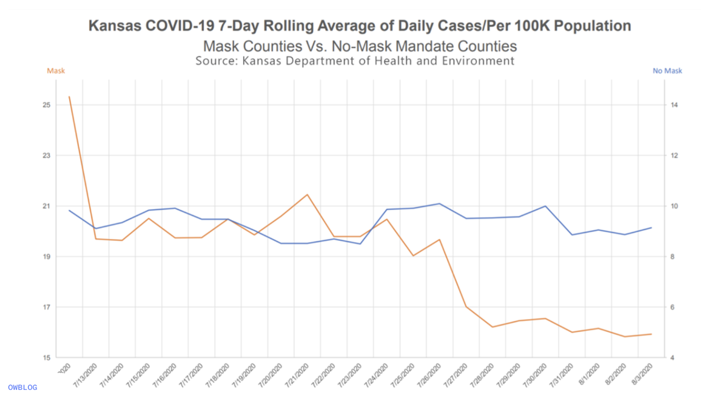

Lab 07 - Conveying the right message through visualisation
================
Benjamin Egan
2-24-25

Link to Assignment:
<https://datascience4psych.github.io/DataScience4Psych/lab07.html>

## Assignment Details

In this lab, our goal is to reconstruct and improve a data visualization
concerning COVID-19 and mask-wearing practices. We aim to explore how
data visualizations can sometimes mislead and learn techniques to
correct these misrepresentations.

The following visualization was shared on Twitter as “extraordinary
misleading”.

<figure>

<figcaption aria-hidden="true">Original Kansas Graph</figcaption>
</figure>

### Create Kansas COVID Data

``` r
Kansas_Mask <- tribble(
  ~date, ~count, ~mask_status,
  "7/12", 25.5, "mask",
  "7/13", 19.8, "mask",
  "7/14", 19.7, "mask",
  "7/15", 20.5, "mask",
  "7/16", 19.8, "mask",
  "7/17", 19.8, "mask",
  "7/18", 20.5, "mask",
  "7/19", 20, "mask",
  "7/20", 20.7, "mask",
  "7/21", 21.3, "mask",
  "7/22", 19.8, "mask",
  "7/23", 19.8, "mask",
  "7/24", 20.5, "mask",
  "7/25", 19, "mask",
  "7/26", 19.5, "mask",
  "7/27", 17, "mask",
  "7/28", 16.3, "mask",
  "7/29", 16.5, "mask",
  "7/30", 16.7, "mask",
  "7/31", 16, "mask",
  "8/01", 16.3, "mask",
  "8/02", 15.8, "mask",
  "8/03", 16, "mask",
  "7/12", 9.8, "no mask",
  "7/13", 9.2, "no mask",
  "7/14", 9.5, "no mask",
  "7/15", 9.8, "no mask",
  "7/16", 9.9, "no mask",
  "7/17", 9.6, "no mask",
  "7/18", 9.55, "no mask",
  "7/19", 9, "no mask",
  "7/20", 8.4, "no mask",
  "7/21", 8.4, "no mask",
  "7/22", 8.6, "no mask",
  "7/23", 8.3, "no mask",
  "7/24", 9.8, "no mask",
  "7/25", 9.9, "no mask",
  "7/26", 10.1, "no mask",
  "7/27", 9.6, "no mask",
  "7/28", 9.6, "no mask",
  "7/29", 9.65, "no mask",
  "7/30", 10, "no mask",
  "7/31", 8.7, "no mask",
  "8/01", 9, "no mask",
  "8/02", 8.7, "no mask",
  "8/03", 9.2, "no mask",
)
Kansas_Mask
```

    ## # A tibble: 46 × 3
    ##    date  count mask_status
    ##    <chr> <dbl> <chr>      
    ##  1 7/12   25.5 mask       
    ##  2 7/13   19.8 mask       
    ##  3 7/14   19.7 mask       
    ##  4 7/15   20.5 mask       
    ##  5 7/16   19.8 mask       
    ##  6 7/17   19.8 mask       
    ##  7 7/18   20.5 mask       
    ##  8 7/19   20   mask       
    ##  9 7/20   20.7 mask       
    ## 10 7/21   21.3 mask       
    ## # ℹ 36 more rows

### Create Kansas COVID Visual

``` r
Kansas_Mask %>%
ggplot(aes(
  x = date,
  y = count,
  group = mask_status
))+
  geom_line(aes(color = mask_status))+
  theme_minimal()+
   scale_color_manual(values=c("blue", "red"))+
  labs(
    x = "Date",
    y = "Average daily cases per 100k",
    title = "Kansas COVID-19 7-day rolling average in 2020",
    subtitle = "Mask Counties vs No-Mask Mandate Counties",
    color = "Mask status"
  )+
  theme(axis.text.x = element_text(angle = 45, vjust = 0.5, hjust=.5))
```

<!-- -->

What is more clear from this visualization is the huge difference in
number of cases. It’s harder to see the drop in cases after mid July.
From the visualization (and assuming I read the original graph
correctly), it looks like places that don’t enforce masks have overall
lower rates of COVID cases than places that mandate masks. This seems
wrong based on my prior knowledge.

The key factors that help this visualization is the accurate scaling of
the y axis. Seeing the space between the two graphs shows the clear
difference no mandate makes.

To show the reverse, I would make sure that both graphs were on
different scales, masking the true effect (see what I did there?) and
highlighting the downward trend for masking counties and variability of
the no mask counties.

### Second Visualization

``` r
Kansas_Mask %>%
ggplot( aes(
  x = date,
  y = count,
  group = mask_status,
  color = mask_status
))+
  facet_wrap(~mask_status, scales = "free")+
  scale_color_manual(values = c("green4","red")) +
  geom_line()+
  theme_bw()+
  labs(
    x = "Date",
    y = "Average daily cases per 100k",
    title = "Kansas COVID-19 7-day rolling average in 2020",
    subtitle = "Mask Counties vs No-Mask Mandate Counties",
    color = "Mask status"
  )+
  theme(axis.text.x = element_text(angle = 45, vjust = 0.5, hjust=.5, size = 8))
```

<!-- -->

This is just one way to change the visual of the data to suggest a no
mask policy. By using facet_wrap() and set the scales to free, I was
able to change how the data looks. I kept the same shape of the mask
condition, showing a downward trend of COVID cases over time. In the no
mask, condition, it now appears that there is a lot of daily variation
in the COVID cases, suggesting that not wearing masks will cause unknown
effects. This is also a silly edit, but the red and green on the graph
subconsciously signal good and bad to the viewer.

## Other Options

``` r
True_Kansas <- Kansas_Mask %>%
  mutate (true_count = Kansas_Mask$count * 100000)


True_Kansas %>%
ggplot(aes(
  x = date,
  y = true_count,
  group = mask_status
))+
  geom_line(aes(color = mask_status))+
  theme_minimal()+
   scale_color_manual(values=c("blue", "red"))+
  labs(
    x = "Date",
    y = "Average daily cases per 100k",
    title = "Kansas COVID-19 7-day rolling average in 2020",
    subtitle = "Mask Counties vs No-Mask Mandate Counties",
    color = "Mask status"
  )+
  theme(axis.text.x = element_text(angle = 45, vjust = 0.5, hjust=.5))+ 
   coord_cartesian(ylim = c(0, 2556000))
```

<!-- -->

This graph can be used to remind people that COVID cases are still
prevalent in the no-mask counties.

``` r
Kansas_Mask %>%
ggplot( aes(
  x = date,
  y = count,
  group = mask_status,
  color = mask_status
))+
  facet_wrap(~mask_status, scales = "free")+
  scale_color_manual(values = c("green4","red")) +
  geom_line()+
  theme_bw()+
  labs(
    x = "Date",
    y = "Average daily cases",
    title = "Kansas COVID-19 7-day rolling average in 2020",
    subtitle = "Mask Counties vs No-Mask Mandate Counties",
    color = "Mask status",
    caption = "Cases reported per 100k"
  )+
 theme(axis.text.x = element_text(angle = 45, vjust = 0.5, hjust=.5, size = 8),
        axis.text.y = element_blank(),
        axis.ticks.y = element_blank())
```

<!-- -->

We can also drop the y axis entirely to further change the data. This
way we further push the daily changes as the most important feature
instead of the actual number of cases.
